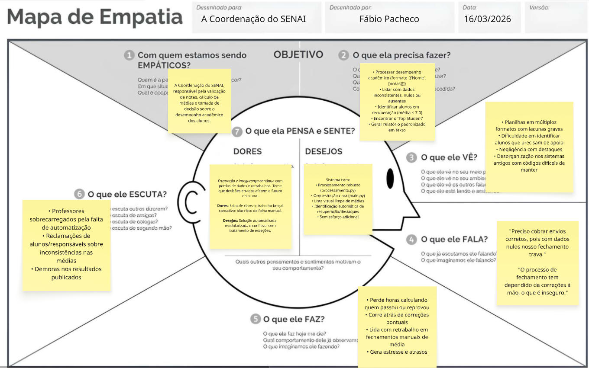
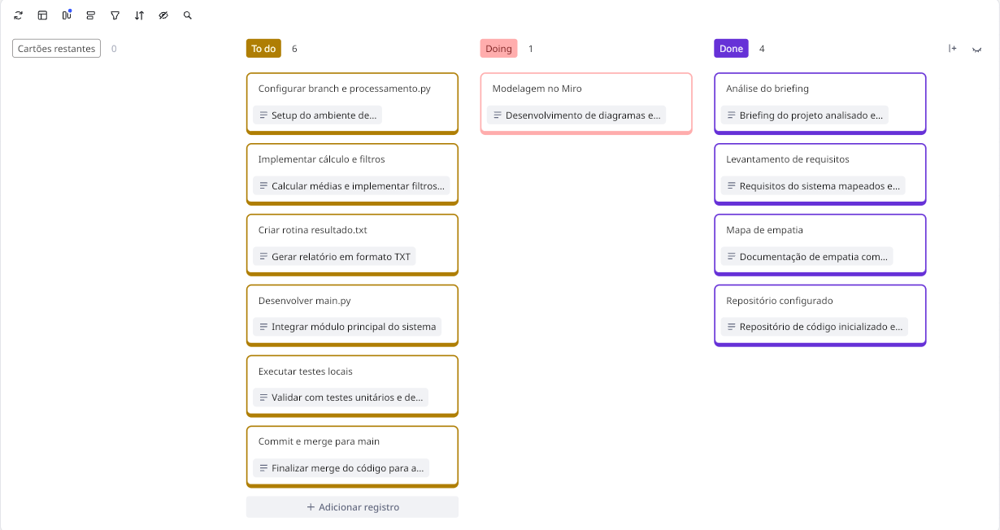

# Atividade Kanban II - SENAI Ciência de Dados

Este repositório contém a solução da atividade "Metodologias Ágeis - Kanban II". O objetivo é desenvolver um programa em Python para processar o desempenho acadêmico dos alunos, usando listas e tuplas, tratando dados corrompidos e gerando um relatório detalhado (`resultado.txt`).

---

## 2. Levantamento de Requisitos

Abaixo estão os requisitos e regras de negócio mapeados a partir do _Briefing_ da Coordenação do SENAI:

### Requisitos Funcionais (RF)

- **RF01:** O sistema deve receber e processar uma entrada de dados estruturada em uma lista de tuplas no formato `[("Nome", [notas])]`.
- **RF02:** O sistema deve validar a lista de notas de cada aluno, identificando notas ausentes (vazias) ou possíveis corrupções de dados (valores nulos).
- **RF03:** O sistema deve usar estruturas de repetição para percorrer as notas e calcular a média aritmética de cada aluno validado.
- **RF04:** O sistema deve identificar automaticamente se um aluno está em "Recuperação".
- **RF05:** O sistema deve identificar e destacar o aluno com o melhor desempenho ("Top Student").
- **RF06:** Ao final da execução, o sistema deve exportar os dados consolidados para um arquivo de texto chamado `resultado.txt` contendo as médias, situação dos alunos e o Top Student.

### Requisitos Não-Funcionais (RNF)

- **RNF01:** A solução deve ser desenvolvida em Python.
- **RNF02:** O código não pode estar em um arquivo único; deve ser **modularizado**, separando a lógica de negócios na qual um arquivo se chamará `processamento.py` e a execução principal deverá ocorrer no arquivo `main.py`.
- **RNF03:** O código deve conter tratamento de erros adequado durante o processamento de variáveis (dados inconsistentes) para que a aplicação não "quebre" na execução.
- **RNF04:** O código final produzido pelo desenvolvedor dever ser versionado no GitHub usando branches separadas (ex: `feat/calculo`) e passar por um fluxo de Merge para a branch `main`.

### Regras de Negócio (RN)

- **RN01:** A situação de _Recuperação_ aplica-se apenas a alunos cuja média final seja inferior a **7.0**.
- **RN02:** O título de _Top Student_ é dado exclusivamente ao aluno que possuir a **maior média** dentre todos os registros válidos processados da turma.

---

## 3. Metodologia (Design Thinking e Gestão Ágil)

> 📌 **Acompanhamento Visual e Dinâmico:** O detalhamento em texto abaixo sobre o Mapa de Empatia e o Kanban serve como um registro estrutural de como o planejamento inicial foi concebido. A gestão ágil oficial, dinâmica e visual das tarefas e ideias do projeto ocorre em nosso **[Board no Miro](https://miro.com/welcomeonboard/cWh0SW8wbmNMNEdGakYyUXJlV3owNCs1Lzk4aktHTVNlUVlaYVQxTk41bzB1Z3BEelV4WGptZmpQaVViTEZTRWIzZHhOV1l2Wk40dEpjWGhSSFNHbHlodXBEWmpTdVNCdDdoNFNuSEh1aEFLdjlzZFptUCttK2lDYUdnQVRFeFNyVmtkMG5hNDA3dVlncnBvRVB2ZXBnPT0hdjE=?share_link_id=724497200461)**.
>
> _As capturas de tela das dinâmicas realizadas no Miro encontram-se documentadas na pasta:_ `prints/`.

### Mapa de Empatia (Coordenação do SENAI)



---

### Quadro Kanban do Projeto



---

### Exemplo de Saída (`resultado.txt`)

O processamento das notas irá gerar um arquivo de saída semelhante a este:

```text
=== RELATÓRIO FINAL DE DESEMPENHO ACADÊMICO ===

ALUNOS PROCESSADOS:
Arthur: média 9.00
Bruno: média 8.00
Fábio: média 9.00
Guilherme: média 9.00

ALUNOS EM RECUPERAÇÃO:
Nenhum aluno em recuperação.

TOP STUDENT:
Arthur: média 9.00

ALUNOS COM INCONSISTÊNCIA DE DADOS:
Felipe
Pedro
Renato
André
```
